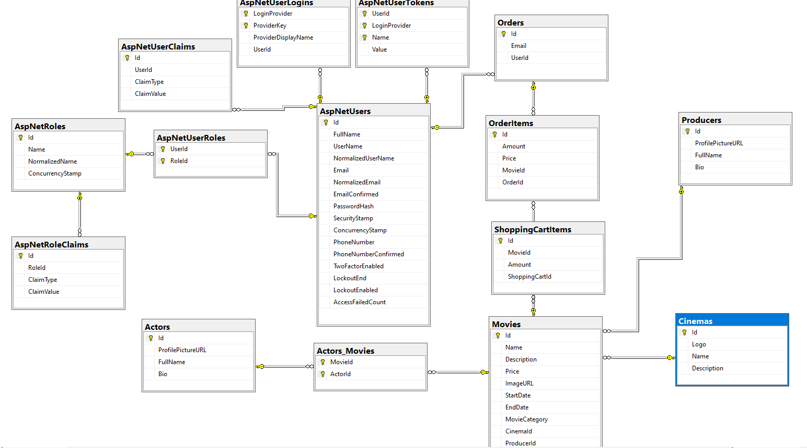

# Etickets

 

- E Tickets uygulaması ile admin ve user olmak üzere iki rol bulunmaktadır.  
- Admin kullanıcı listesini görebilir. Satın alınan biletleri görebilir.  
- Admin yönetmen, sinema, aktör ve yeni film ekleyebilir, düzenleyebilir ve silebilir. 
- User filmleri listeleyebilir.  
- User almak istediği filmi sepetine ekleyebilir ve paypal ile ödeme yapabilir. 

## Geliştirildiği Teknolojiler
| Numara | Teknoloji | 
| :--- | :---: | 
| 1 | .NET Core MVC |
| 2 | MsSQL |
| 3 | JS |
| 4 | HTML5 |
| 5 | CSS  |
| 6 | BOOTSTRAP |

## Ön Gereklilikler ve Kurulum
Aslında projeyi çalıştırmak oldukça basit.Uygulamayı başarılı bir şekilde çalıştırıp kullanmak için bilgisayarınızda en güncel dotnet sdk'sının kurulu olması gerekmektedir. Ardından ise veritabanı için Sql Server veritabanına sahip olmanız gerekmektedir. Kurulumlarınızı eksiksiz tamamladıysanız yapmanız gereken ilk şey migration eklemek olacak bunu Package Manager Console içerisinde "migrations add InitialCreate" komutu yardımıyla yapabilirsiniz. Daha sonra ise bu migration dosyası aracılığı ile veri tabanımızı kurmak için "update-database" komutunu kullanabilirsiniz.

### Admin 

Email : admin@gmail.com
Parola : 123456aA@

### User 
Email : user@gmail.com
Parola : 123456aA@

Bu Emailleri kullanarak giriş yapabiliriz. Yeni kullanıcı oluşturmak için kayıt ol seçeneğini seçerek yeni kullanıcı oluşturabiliriz.

